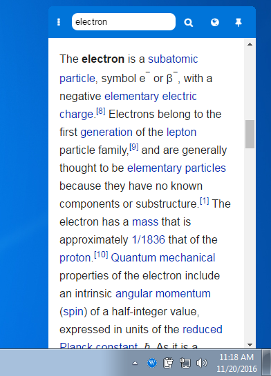

# Menubar Wiki
> A simple menubar app for browsing Wikipedia.  Built with [Electron](https://electron.atom.io) and [Menubar](https://github.com/maxogden/menubar)

## Installation
### Clone
```
$ git clone https://github.com/chromatical/menubar-wiki
$ cd menubar-wiki
```
### Install Dependencies and Run
```
$ npm install
$ npm start
```
## Screenshot

